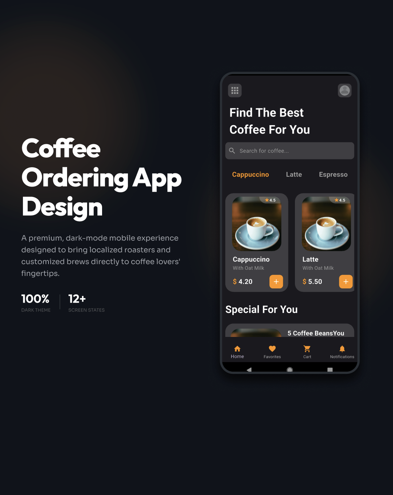
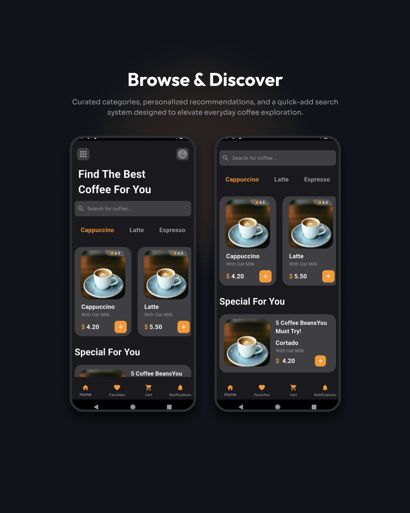
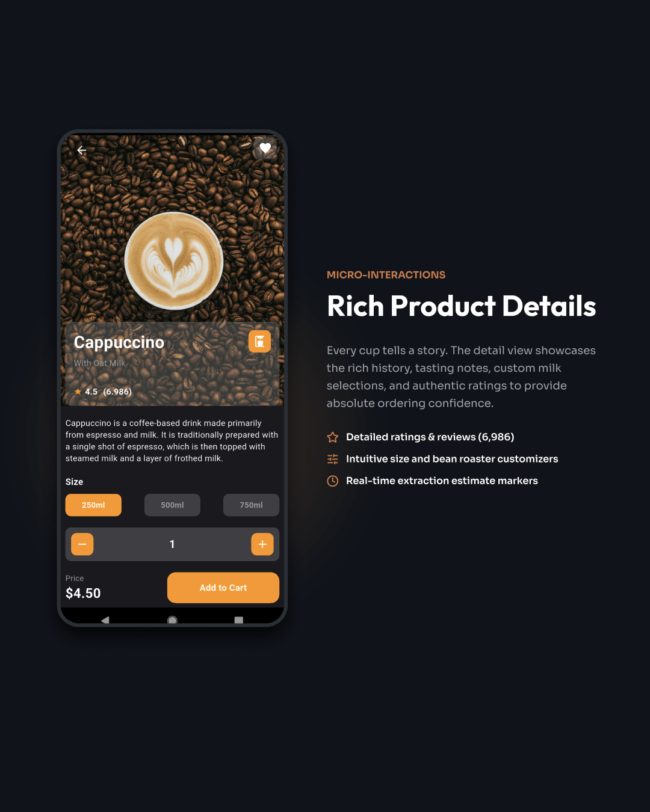
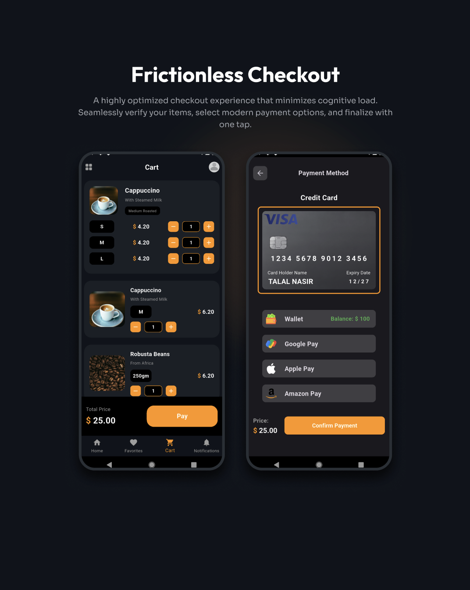

<div align="center">

# Coffee Shop App ☕

### A polished, dark-mode coffee ordering experience built with Flutter

[](https://flutter.dev/)
[](https://dart.dev/)


</div>



## About

Coffee Shop App is a Flutter UI project that turns coffee discovery and ordering into a focused mobile experience. It combines a warm orange accent with a rich dark interface across browsing, product customization, favorites, cart management, and checkout.

The project is designed as a front-end showcase. Product, cart, favorite, and payment data are demonstrated locally; no live ordering or payment backend is connected.

## Highlights

- Browse featured drinks and coffee categories
- Search through a clean, product-focused home screen
- View ratings, descriptions, sizes, quantities, and dynamic prices
- Save customized drinks to favorites
- Manage multiple products and sizes in the cart
- Review the total before continuing to checkout
- Choose from card, wallet, Google Pay, Apple Pay, and Amazon Pay UI options
- Navigate a consistent, responsive dark-mode interface

## Screenshots

<p align="center">
  
  
</p>

<p align="center">
  
  
</p>

## Built With

- [Flutter](https://flutter.dev/) for the cross-platform application UI
- [Dart](https://dart.dev/) for application logic and state
- Material widgets and icons for interface components
- Local image assets for coffee products and payment methods

## Getting Started

### Prerequisites

- Flutter SDK installed and available on your command line
- An Android emulator, iOS Simulator, desktop target, or connected device

### Run locally

```bash
git clone https://github.com/TalalNasir1/coffee-shop-app.git
cd coffee-shop-app
flutter pub get
flutter run
```

## Project Structure

```text
coffee-shop-app/
├── assets/             # Product and payment images
├── lib/
│   ├── widgets/        # Reusable text components
│   ├── HomePage.dart   # Discovery and featured products
│   ├── DetailPage.dart # Product options and favorites
│   ├── CartPage.dart   # Cart and quantity controls
│   ├── PaymentScreen.dart
│   └── main.dart       # Application entry point
├── screenshots/        # Repository showcase images
└── pubspec.yaml        # Flutter configuration and assets
```

## Current Scope

This repository focuses on the customer-facing interface and interaction flow. Authentication, persistent storage, a product API, order fulfillment, and real payment processing are natural next steps for a production version.
